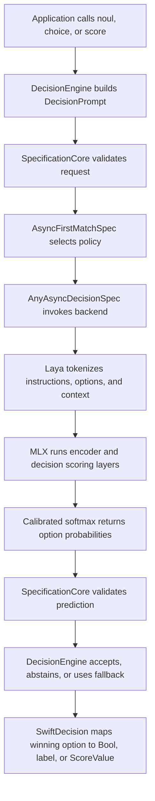

# Laya MLX Backend: Inference Pipeline

This document describes how SwiftDecision turns a typed decision request into a local Laya prediction with MLX, and how the prediction becomes an application-level result. It documents the current implementation; it is not a model card or a claim about model accuracy.

## Scope

`LayaMLXBackend` is an optional native backend for the English `aac6fef/laya-mlx` checkpoint. It runs the checkpoint's ModernBERT encoder and typed-decision scoring layers with MLX from Swift. It does not generate prose, call a cloud API, invoke Python, or download model files implicitly.

The backend is compiled only when the package's non-default `MLX` SwiftPM Trait is enabled. The checkpoint is supplied as a local directory. This is an independent Swift port of the checkpoint runtime, not an official Convai Innovations release. The API is available on Apple Silicon with macOS 14 or later, or iOS 17 or later. The base SwiftDecision package can still be used without MLX and retains its lower deployment targets.

## End-to-end flow



The decision engine owns request and output validation, policy selection, timeout, cancellation checks, and the final acceptance/abstention/fallback result. The model backend owns tokenization, model inference, calibration, and the probability vector. A backend error remains an error; it is not converted into an abstention.

## 1. Load the local checkpoint

Create the backend with a directory containing the checkpoint configuration, tokenizer files, and `model.safetensors`:

```swift
let backend = try LayaMLXBackend(checkpointAt: checkpointURL)
let engine = DecisionEngine(backend: backend)
```

The default precision is FP16. Passing `precision: .float32` casts loaded parameters to FP32 for comparison runs; it does not rewrite the checkpoint files. Backend initialization reads and validates `encoder/config.json`, `rl_agent_config.json`, `tokenizer/tokenizer_config.json`, `tokenizer/tokenizer.json`, the tokenizer special token IDs, and `model.safetensors`. Missing or unsupported files fail initialization with a `LayaMLXError`.

The application downloads or otherwise provisions the checkpoint before constructing the backend. This keeps model size and licensing under application control and lets the app decide when and where to store the files.

## 2. Form a typed request

The public API asks a constrained question, rather than asking a generative model to produce JSON. Each request contains instructions, a context to evaluate, and an ordered set of candidate options.

### Noul: evaluate a yes/no statement

```swift
let outageAffectsEveryone = try await engine.noul(
    id: "outage-impact",
    statement: "Is the service outage affecting every customer?",
    context: "The status page reports that all customers are unable to sign in."
)
```

`noul` creates two fixed options in this order: `false`, then `true`. SwiftDecision maps the selected option back to `Bool`.

### Choice: select a typed application label

```swift
let team = try await engine.choice(
    id: "support-routing",
    instructions: "Choose the best team to handle this customer message.",
    context: "My invoice contains a duplicate charge from yesterday.",
    options: [
        ChoiceOption(label: "support", description: "support: account access or product use"),
        ChoiceOption(label: "billing", description: "billing: invoices, refunds, or charges"),
        ChoiceOption(label: "sales", description: "sales: plan selection or purchasing")
    ]
)
```

The label is retained in application code. The model-facing options are descriptions in the caller's order; the probability at each index maps back to the label at the same index.

### Score: evaluate an ordered rubric

```swift
let quality = try await engine.score(
    id: "answer-quality",
    instructions: "Rate how completely the response answers the question.",
    context: "Question: How do I reset my password? Response: Open Settings, choose Security, and select Reset Password.",
    levels: [
        (description: "does not answer the question", value: 0.0),
        (description: "partially answers the question", value: 1.0),
        (description: "fully answers the question", value: 2.0)
    ]
)
```

The API returns the most likely rubric level and its zero-based index. It also calculates `expectedValue` as the probability-weighted sum of the caller's numeric level values. For example, with probabilities `p[i]` and rubric values `v[i]`, `expectedValue = sum(p[i] * v[i])`.

## 3. Render and tokenize the model input

SwiftDecision first constructs a backend-independent `DecisionPrompt` with a decision kind, instructions, context, and ordered options. Laya's tokenizer converts the following information into token IDs:

- the decision kind and instructions, formatted as a question;
- each option description, prefixed by a mask token used as its scoring position;
- the context text, used as the state to evaluate.

Conceptually, the sequence has this structure:

```text
[CLS] {kind} question: {instructions} [SEP]
[MASK] {option 1} [MASK] {option 2} ... [SEP]
{context} [SEP]
```

This is a schematic, not a byte-for-byte prompt: actual token boundaries and special token IDs come from the checkpoint tokenizer. The runtime reserves space for instructions and options, truncates them to the checkpoint's configured head budget, then uses remaining sequence capacity for context. It rejects invalid requests that cannot fit the option/head budget or model sequence limit.

`DecisionOption.id` is used by SwiftDecision to map a result back to the caller's value. Laya scores the option descriptions and returns probabilities by position; the model does not need to generate or return those identifiers.

## 4. Run the MLX forward pass

The token IDs become an `MLXArray`. The backend then performs the checkpoint's neural computation in MLX:

1. Look up token embeddings and normalize them.
2. Run the ModernBERT encoder layers, including attention and feed-forward operations.
3. Add an embedding for the requested decision kind (`choice`, `score`, or `noul`).
4. Run the decision Transformer layers.
5. Select the hidden state at each option's mask position and pass it through the scoring head to produce one logit per option.

This is a bidirectional encoder/scorer pass over the full input, not autoregressive next-token generation. MLX represents intermediate values as arrays and evaluates its computation graph when the result is needed; the backend explicitly evaluates the final probabilities before reading them back into Swift values. MLX Swift provides the Swift API over MLX, whose device and memory model supports Apple Silicon CPU and GPU execution. See the [MLX project](https://github.com/ml-explore/mlx) and [MLX Swift project](https://github.com/ml-explore/mlx-swift) for framework details.

## 5. Convert logits into probabilities

The backend selects a calibration temperature for the decision kind and option-count range, divides the logits by that temperature, and applies softmax:

```text
probability[i] = softmax(logit[i] / temperature)
```

It returns one probability per option in the exact input order, with model identifier `laya-mlx`. The engine then checks that the values are finite and nonnegative and that they sum to approximately 1.

## 6. Validate and resolve the decision

After inference, SwiftDecision checks that the probability count matches the request, every value is finite and nonnegative, and the total is normalized within tolerance. It chooses the highest-probability option and evaluates it against the policy configured for that decision kind. The policy can accept the result, abstain for human review, or use an explicit caller-provided fallback.

For `Choice`, the winning index maps to the corresponding typed label. For `Noul`, it maps to `false` or `true`. For `Score`, it maps to a rubric level and contributes to the expected numeric value. A low-confidence prediction is not silently treated as a model error, and a thrown backend error is not silently treated as abstention.

## Runtime characteristics and limits

- **Local weights:** the backend reads files from the supplied directory and performs inference locally; it does not fetch weights at runtime.
- **Optional dependency:** the `MLX` Trait enables MLX dependencies and the `LayaMLXBackend` API. With the trait disabled, the backend source is excluded from compilation and its API is unavailable; the base package remains usable.
- **Platform floor:** the backend API requires macOS 14+ or iOS 17+ on Apple Silicon.
- **Precision:** FP16 is the default; FP32 is available for numerical comparison and uses more memory.
- **Language/checkpoint scope:** this implementation loads the English `aac6fef/laya-mlx` checkpoint. The model publisher lists a separate multilingual checkpoint; it is not selected by this backend today.
- **No text generation:** the output is a structured set of probabilities, not a completion, explanation, or generated JSON document.
- **No model-quality guarantee:** correct loading and numerical parity establish runtime compatibility for tested inputs, not correctness for every task or input.

## Source map

- [`LayaMLXBackend.swift`](../Sources/SwiftDecision/LayaMLXBackend.swift) — checkpoint loading, tokenization, encoder/head computation, calibration, and output conversion.
- [`DecisionAPI.swift`](../Sources/SwiftDecision/DecisionAPI.swift) — typed public API, `DecisionPrompt`, engine validation, policy routing, timeout, and outcome mapping.
- [`LayaParityTests.swift`](../Tests/SwiftDecisionTests/LayaParityTests.swift) — fixed Noul, Choice, and Score inputs for local checkpoint checks.
- [SwiftDecision README](../README.md) — trait setup, local parity commands, and current benchmark status.
- [Laya MLX model card](https://huggingface.co/aac6fef/laya-mlx) — checkpoint architecture, supported use, provenance, and model-level limitations.
